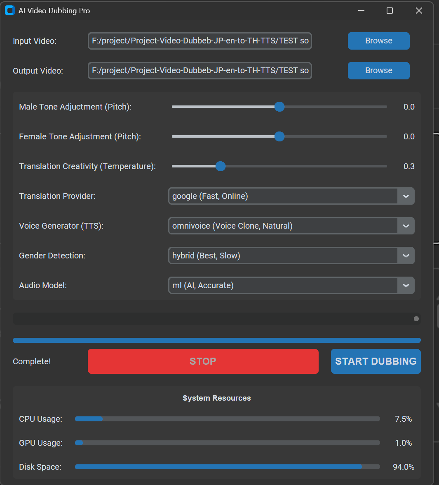

# AI Video Dubbing Pro (JP/EN -> Thai) 🎥🇹🇭

A comprehensive, production-grade AI-powered video dubbing workstation designed for high-fidelity, natural **Thai localization** from Japanese and English sources. It integrates voice cloning, context-aware LLM subtitle translation, dual-audio container muxing, vocal separation, and an integrated YouTube downloader into a streamlined GUI.

---

## 📺 Demo & UI Preview

### GUI Interface


### Video Demo
[](https://youtu.be/xdQI-p60SMg)

---

## 🚀 Key Features / ฟังก์ชันหลัก

*   **⬇️ Integrated YouTube Downloader (ดูดวิดีโอจาก YouTube โดยตรง)**:
    *   วางลิงก์ YouTube (เช่น `https://www.youtube.com/watch?v=...`) เลือกความละเอียดที่ต้องการ (**1080p, 720p, 480p, 360p, Best**)
    *   ดาวน์โหลดและรวมสตรีมภาพ-เสียงคุณภาพสูงสุดเป็นไฟล์ `.mp4` ผ่าน FFmpeg
    *   **Auto-populate**: เมื่อดาวน์โหลดเสร็จ จะกรอกชื่อไฟล์เข้าช่อง `Input Video` และตั้งชื่อ `Output Video` ในหน้าต่างหลักให้อัตโนมัติ พร้อมเริ่มกระบวนการพากย์ได้ทันที
    *   มีปุ่มเรียกใช้งานได้ 2 จุด: ปุ่ม `⬇️ YouTube` ข้างช่องเลือกไฟล์ และปุ่ม `⬇️ YouTube DL` ในแท็บ Utilities

*   **🎧 Dual Audio Streams & Lossless Stream-Copy Muxing (ระบบ 2 แทร็กเสียง)**:
    *   **Track 1**: เสียงต้นฉบับดั้งเดิม (`Original Audio`)
    *   **Track 2**: เสียงพากย์ภาษาไทย (`Thai Dubbed (OmniVoice)`) — กำหนดเป็น Default Playback Track
    *   **Direct FFmpeg Stream Copy (`-c:v copy`)**: ผสานเสียงเข้ากับวิดีโอต้นฉบับโดยไม่ต้อง Re-encode ภาพใหม่ ใช้เวลาประมวลผลเพียง 2-3 วินาที และคงคุณภาพวิดีโอ 100%
    *   สามารถสลับภาษาเสียงไปมาระหว่างต้นฉบับและเสียงพากย์ไทยได้อย่างอิสระบนโปรแกรมเล่นวิดีโอ (VLC, PotPlayer, Smart TV)

*   **🧠 Context-Aware Offline Translation (แปลซับไตเติลเข้าใจบริบทด้วย LLM ออฟไลน์)**:
    *   **Qwen2.5-3B-Instruct (`local-qwen`)**: โมเดล LLM รันบน GPU ในเครื่อง 100% โดยไม่ต้องต่ออินเทอร์เน็ตหรือพึ่งพาคลาวด์ภายนอก
    *   **Sliding-Window Dialogue Context**: ส่งประวัติบทสนทนา 2-3 บรรทัดก่อนหน้าเข้าระบบ ช่วยให้สรรพนาม (ฉัน/ผม/เธอ/เรา) ระดับความสุภาพ และอารมณ์ของตัวละครถูกต้องแม่นยำต่อเนื่องตลอดทั้งเรื่อง
    *   **CTranslate2 NLLB-200 (`local-ctranslate2`)**: ทางเลือกแปลตรงภาษาญี่ปุ่นสู่ภาษาไทย (Direct JP->TH) ความเร็วสูงพิเศษ (Fastest GPU inference)

*   **🎙️ Kotoba-Whisper Japanese SOTA Transcription (ถอดเสียงภาษาญี่ปุ่นระดับ SOTA)**:
    *   ใช้โมเดล **Kotoba-Whisper v2.2** ถอดเสียงภาษาญี่ปุ่นที่มีความแม่นยำสูงสุด ลดปัญหาคำซ้ำ (Zero Hallucination)
    *   ทำงานร่วมกับ **Voice Activity Detection (VAD)** ตัดแบ่งท่อนคำพูดอย่างแม่นยำตรงตามจังหวะเวลาพูดจริงในวิดีโอ
    *   มีระบบตรวจจับภาษาและสลับไปใช้ **faster-whisper (Large-v2)** ให้อัตโนมัติสำหรับภาษาอังกฤษและภาษาอื่นๆ

*   **🗣️ Advanced OmniVoice TTS & Voice Cloning (สังเคราะห์เสียงพากย์และโคลนเสียง)**:
    *   **Tone Only Mode (Acoustic Tone Profiling, No Foreign Accent)**: สกัดความถี่ Fundamental Frequency (F0) และ Register เสียงตัวละครจริง เพื่อควบคุม OmniVoice Voice Design สังเคราะห์เสียงพากย์ไทยด้วยสำเนียงธรรมชาติแท้ 100% ไร้สำเนียงต่างชาติ
    *   **Full Clone Mode (Voice + Original Accent)**: โคลนทั้งเนื้อเสียงและจังหวะพูดตรงตาม Reference Audio
    *   **Consistent Speaker Voice Profile**: จดจำและล็อกโปรไฟล์เสียงตัวละครชาย/หญิงตลอดทั้งคลิป ไม่เปลี่ยนโทนเสียงไปมา
    *   รองรับทั้ง **OmniVoice**, **Microsoft Edge-TTS**, และ **Facebook MMS**

*   **📑 Standalone Subtitle Translator (เครื่องมือแปลไฟล์ .srt ในตัว)**:
    *   หน้าต่างเครื่องมือแยกสำหรับแปลไฟล์ซับไตเติล `.srt` โดยเฉพาะ สามารถเลือกใช้โมเดล Qwen2.5-3B หรือ NLLB-200 แล้วบันทึกเป็น `.th.srt` ได้ทันทีโดยไม่ต้องรันทั้งกระบวนการวิดีโอ

*   **👥 Advanced Gender Detection & Speaker Diarization (แยกแยะเพศและล็อกเพศรายตัวละคร)**:
    *   **Robust ML Model (`audeering/wav2vec2-large-robust-12-ft-age-gender`)**: โมเดล ML ตรวจจับเพศระดับ SOTA ที่เทรนจากเสียงพูดหลากภาษาและเสียงในชีวิตจริง แม่นยำกว่า LibriSpeech ดั้งเดิม ทนทานต่อเสียงอนิเมะและเสียงสูง
    *   **Speaker Clustering & Majority Voting**: สกัด Acoustic Timbre Embedding แล้วจัดกลุ่มประโยคด้วย Cosine Distance เป็นรายตัวละคร (`SPEAKER_00`, `SPEAKER_01`, ...)
    *   **Linguistic Pronoun Hints**: วิเคราะห์สรรพนามบอกเพศในประโยคภาษาญี่ปุ่น (`僕`, `俺`, `ぜ`, `ぞ` = ชาย / `あたし`, `かしら`, `わよ` = หญิง) เข้ามาโหวตคะแนนร่วมกับโมเดลเสียง
    *   **Zero Gender Flipping**: ตัดสินเพศของตัวละครเพียงครั้งเดียว แล้วล็อกเพศให้ทุกประโยคของตัวละครนั้นทั้งคลิป ไม่สลับไปมา

*   **🛡️ Dynamic VRAM Management & OOM Prevention**:
    *   ระบบคืนหน่วยความจำ GPU อัตโนมัติ (Unload โมเดล ML Gender Classifier และ Qwen LLM ทันทีที่ทำงานเสร็จในแต่ละขั้นตอน)
    *   Thread-locking ป้องกันการโหลดโมเดลซ้อนทับกัน ช่วยให้สามารถรันบนการ์ดจอ VRAM 8 GB - 12 GB ได้อย่างราบรื่นโดยไม่เกิด CUDA Out of Memory

*   **🔄 One-Click Reset Settings**:
    *   ปุ่ม `🔄 Reset Settings (New Task)` ล้างค่าและพาธทั้งหมดกลับสู่ค่าเริ่มต้น พร้อมสำหรับการเริ่มทำงานโปรเจกต์ใหม่ได้ในคลิกเดียว

---

## 🆕 Recent Updates & Changelog / การปรับปรุงแก้ไขล่าสุด

*   **🎛️ Acoustic Tone Profiling (Tone Only Voice Cloning)**:
    *   เพิ่มระบบวิเคราะห์ความถี่เสียง F0 (Fundamental Frequency) และ Register คาแรกเตอร์ตัวละครจากคลิปต้นฉบับ
    *   แปลงเป็น OmniVoice Voice Design Instruct (`male/female`, `age`, `pitch levels`) สังเคราะห์เสียงพากย์ไทยด้วยสำเนียงไทยแท้ 100% ไร้สำเนียงต่างชาติ แต่คงโทนเสียงตัวละครเดิมไว้ครบถ้วน
    *   เพิ่มตัวเลือกใน GUI: `Tone Only (Voice Tone, No Foreign Accent)`, `Full Clone (Voice + Original Accent)`, `Disabled (Standard TTS)`
*   **👥 Dual-Mode Advanced Gender Detection & Speaker Clustering**:
    *   เพิ่มโมเดล ML ตรวจจับเพศ `ml-robust` (`audeering/wav2vec2-large-robust-12-ft-age-gender`) ทนทานต่อเสียงภาษาญี่ปุ่นและเสียงสูง
    *   เพิ่มระบบ **Speaker Clustering + Duration-Weighted Majority Voting** และ **Linguistic Pronoun Analysis** เพื่อล็อกเพศตัวละครตลอดทั้งเรื่อง (Zero Gender Flipping)
    *   เพิ่มตัวเลือกใน GUI: Dropdown `Audio Model` (Robust ML / LibriSpeech / Pitch) และ Checkbox `Lock Gender per Speaker (Clustering)`
*   **🎬 YouTube Video Downloader Module**:
    *   เพิ่มโมดูล `modules/youtube_downloader.py` และหน้าต่าง `YouTubeDownloaderWindow` ใน GUI
    *   รองรับการเลือกความละเอียด 1080p, 720p, 480p, 360p, Best และ auto-populate ข้อมูลลงใน Main GUI
    *   เพิ่มฟังก์ชัน Self-healing `ensure_yt_dlp()` สำหรับตรวจจับและติดตั้ง `yt-dlp` อัตโนมัติหากยังไม่มีในสภาพแวดล้อม
*   **🎧 Dual Audio Streams (Original + Thai Dubbed)**:
    *   รองรับการสร้างไฟล์วิดีโอที่มี 2 แทร็กเสียงผ่าน FFmpeg Stream Copy (`-c:v copy`) รวดเร็วและไม่ลดทอนคุณภาพ
    *   เพิ่ม Checkbox ควบคุมใน GUI `Dual Audio (Keep Original + Add Thai Track)` (เปิดใช้งานเป็นค่าเริ่มต้น)
*   **🧠 Qwen2.5-3B Context-Aware Subtitle Translation**:
    *   รองรับการแปลบทพูดต่อเนื่องด้วย LLM ในเครื่อง พร้อมระบบป้องกัน CUDA OOM ผ่าน `_qwen_lock` และ Sequential rolling context
    *   เพิ่มคำสั่ง Unload โมเดล Qwen และ ML Gender Classifier หลังเสร็จสิ้นการประมวลผล
*   **🎙️ Kotoba-Whisper Integration**:
    *   เพิ่มตัวเลือกเอนจิน STT `Kotoba-Whisper` สำหรับภาษาญี่ปุ่น และ `faster-whisper large-v2` สำหรับภาษาอื่นๆ
*   **🔄 UI Enhancements**:
    *   เพิ่มปุ่ม `🔄 Reset Settings (New Task)` สำหรับล้างค่าเริ่มงานใหม่
    *   เพิ่มปุ่มทางลัด `⬇️ YouTube` และ `⬇️ YouTube DL`

---

## 🛠️ Prerequisites / สิ่งที่ต้องเตรียม

*   **Operating System**: Windows 10/11 (64-bit)
*   **Python**: 3.10, 3.11 หรือ 3.12
*   **FFmpeg**: ต้องติดตั้งและเพิ่มลงใน System PATH
*   **NVIDIA GPU**: แนะนำสำหรับการประมวลผล CUDA (VRAM 8 GB ขึ้นไป)
*   **uv** (แนะนำ): เพื่อการจัดการ Environment และ Dependencies ที่รวดเร็ว

---

## 📦 Installation & Setup / การติดตั้ง

### วิธีที่ 1: รันด้วย 1-Click Batch Script (แนะนำที่สุดสำหรับ Windows)
หากมี `uv` ติดตั้งอยู่ในเครื่อง สามารถดับเบิลคลิกไฟล์ **`run_uv.bat`** ได้ทันที:
```powershell
.\run_uv.bat
```
*(สคริปต์จะตรวจสอบความพร้อม ติดตั้งแพ็กเกจที่จำเป็น และเปิดหน้าต่าง GUI อัตโนมัติ)*

---

### วิธีที่ 2: ใช้ `uv` ใน Terminal (รวดเร็วและเป็นระเบียบ)
1. **Sync Dependencies**:
   ```powershell
   uv sync
   ```
2. **เปิดโปรแกรม**:
   ```powershell
   uv run python gui.py
   ```

---

### วิธีที่ 3: ใช้ `pip` รูปแบบมาตรฐาน
1. **สร้างและเปิดใช้งาน Virtual Environment**:
   ```powershell
   python -m venv .venv
   .\.venv\Scripts\activate
   ```
2. **ติดตั้ง Dependencies**:
   ```powershell
   pip install -r requirements.txt
   ```
3. **เปิดโปรแกรม**:
   ```powershell
   python gui.py
   ```

---

## ▶️ How to Use / วิธีการใช้งาน

### 1. การใช้งานผ่านหน้าต่าง GUI
1. เปิดโปรแกรมด้วย `.\run_uv.bat` หรือ `python gui.py`
2. **เลือกวิดีโอ**:
   * คลิก **Browse** เพื่อเลือกไฟล์วิดีโอจากเครื่อง หรือ
   * คลิก **⬇️ YouTube** เพื่อใส่ลิงก์ YouTube เลือกความละเอียด แล้วดาวน์โหลดเข้าโปรแกรมอัตโนมัติ
3. **ตั้งค่าการพากย์เสียง**:
   * **STT Engine**: เลือก `Kotoba-Whisper (Japanese SOTA)` (หากวิดีโอเป็นภาษาญี่ปุ่น) หรือ `faster-whisper (Large-v2)`
   * **Translation Engine**: เลือก `local-qwen (Context-Aware LLM)` หรือ `local-ctranslate2 (NLLB-200)`
   * **TTS Provider**: เลือก `omnivoice` พร้อมเลือกโหมด `Timbre Only`
   * **Dual Audio**: ติ๊กเลือก `Dual Audio (Keep Original + Add Thai Track)` หากต้องการเก็บเสียงต้นฉบับไว้คู่กับเสียงพากย์ไทย
4. **เริ่มการทำงาน**:
   * กดปุ่ม **START DUBBING** ระบบจะแสดงความคืบหน้าแบบ Real-time และบันทึกผลลัพธ์ลงในโฟลเดอร์ `output/`

---

## 📂 Project Structure / โครงสร้างโปรเจกต์

```text
├── gui.py                         # Modern CustomTkinter GUI
├── main.py                        # Pipeline Orchestrator & CLI Entrypoint
├── config.py                      # Global Configurations & Engine Settings
├── run_uv.bat                     # Windows 1-Click Launcher Script
├── CONTEXT.md                     # Architecture Decision Records (ADRs)
├── Review/
│   └── UI.png                     # Application GUI Preview Screenshot
├── modules/
│   ├── youtube_downloader.py      # YouTube Stream Extraction & Downloader
│   ├── transcriber.py             # Kotoba-Whisper & Faster-Whisper STT
│   ├── translator.py              # Qwen2.5-3B LLM & CTranslate2 NLLB Translation
│   ├── voice_generator.py         # OmniVoice, Edge-TTS & MMS Voice Cloning
│   ├── gender_classifier.py       # Audio/ML/Visual Voice Gender Detection
│   ├── vocal_isolator.py          # Demucs Background & Vocals Separation
│   └── video_merger.py            # FFmpeg Dual-Audio Stream-Copy Muxer
├── tests_dual_audio.py            # Unit tests for Dual Audio muxing
├── tests_kotoba.py                # Unit tests for Kotoba-Whisper
├── tests_qwen_trans.py            # Unit tests for Qwen context translation
└── tests_youtube_downloader.py    # Unit tests for YouTube downloader
```

---

## 🙏 Acknowledgements / กิตติกรรมประกาศ

ขอขอบคุณโครงการ Open-Source คุณภาพสูงที่เป็นรากฐานของโปรเจกต์นี้:
* **[OmniVoice](https://github.com/k2-fsa/OmniVoice)**: เอนจินสังเคราะห์เสียงและโคลนเสียงภาษาไทยคุณภาพสูง
* **[Kotoba-Whisper](https://github.com/kotoba-tech)**: โมเดลถอดเสียงภาษาญี่ปุ่นระดับ State-of-the-Art
* **[Faster-Whisper](https://github.com/SYSTRAN/faster-whisper)**: เอนจินถอดเสียงความเร็วสูงบน CTranslate2
* **[Qwen2.5](https://github.com/QwenLM/Qwen2.5)**: โมเดลภาษาขนาดใหญ่สำหรับการแปลบทสนทนาที่เข้าใจบริบท
* **[Demucs](https://github.com/facebookresearch/demucs)**: ระบบแยกเสียงร้องและเสียงดนตรีประกอบจาก Meta
* **[yt-dlp](https://github.com/yt-dlp/yt-dlp)**: เครื่องมือแยกและดาวน์โหลดวิดีโอสตรีมมิ่งประสิทธิภาพสูง
