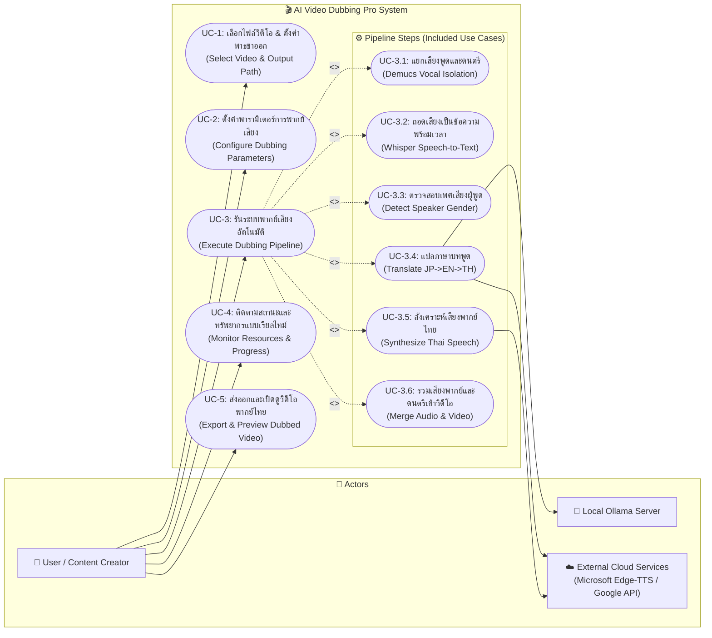

# 📐 System Diagrams - AI Video Dubbing Pro (JP/EN -> TH)

เอกสารสรุปแผนภาพสถาปัตยกรรมเครือข่าย (Network Diagram) และแผนภาพกรณีการใช้งาน (Use Case Diagram) สำหรับโครงการ **AI Video Dubbing Pro**

---

## 1. 🌐 Network & Architecture Diagram

แผนภาพแสดงโครงสร้างการเชื่อมต่อระหว่างระบบภายในเครื่อง (Local Workstation) และบริการภายนอก (External Cloud Services)

```mermaid
flowchart TB
    subgraph ClientLayer [" Client Tier (Local Machine) "]
        GUI["🖥️ GUI Application (gui.py / Tkinter)"]
        CLI["💻 CLI Interface (main.py)"]
    end

    subgraph CoreEngine [" Core Pipeline & Orchestration Layer "]
        Config["⚙️ Config & State Manager (config.py)"]
        Orchestrator["🔄 Main Orchestrator (main.py)"]
        
        subgraph ProcessingModules ["Processing Modules"]
            DemucsMod["🎵 Vocal Isolator (vocal_isolator.py)"]
            WhisperMod["🎙️ Transcriber (transcriber.py)"]
            GenderMod["👤 Gender Detector (audio / ML / visual)"]
            TransMod["🌐 Translator & Validator (translator.py)"]
            TTSMod["🗣️ Voice Generator (voice_generator.py)"]
            MergerMod["🎬 Video Merger (video_merger.py)"]
        end
    end

    subgraph HardwareLocal [" Local Compute & Hardware Resources "]
        CUDA["⚡ NVIDIA GPU (CUDA Accelerator)"]
        CPU["🧠 CPU Multi-Core Engine"]
        Storage["💾 Local Storage (temp/ & output/)"]
    end

    subgraph LocalServices [" Local AI Models & Local Microservices "]
        OllamaSvc["🦙 Ollama Local LLM API\n(http://localhost:11434)\n[Llama3 / Gemma3]"]
        NLLBModel["🤗 HuggingFace NLLB-200 Model\n[facebook/nllb-200-distilled-600M]"]
        WhisperModel["🎙️ Faster-Whisper Model\n[large-v2 / medium]"]
        OmniVoiceEngine["🔊 OmniVoice TTS Engine\n[Voice Cloning / Timbre / Prosody]"]
        DemucsEngine["🎼 Demucs Model (v4)"]
    end

    subgraph ExternalCloud [" External Cloud Services & APIs "]
        EdgeTTSAPI["☁️ Microsoft Azure Edge-TTS Cloud"]
        GoogleAPI["☁️ Google Translate API"]
        OpenAIAPI["☁️ OpenAI API (Optional)"]
    end

    %% Client Interactions
    GUI --> Orchestrator
    CLI --> Orchestrator
    Config --> Orchestrator

    %% Core Pipeline Module Calls
    Orchestrator --> DemucsMod
    Orchestrator --> WhisperMod
    Orchestrator --> GenderMod
    Orchestrator --> TransMod
    Orchestrator --> TTSMod
    Orchestrator --> MergerMod

    %% Module to Hardware / Storage
    DemucsMod & WhisperMod & TTSMod & MergerMod --> Storage
    DemucsMod & WhisperMod & OmniVoiceEngine --> CUDA
    TransMod & MergerMod --> CPU

    %% Module to Local Services
    WhisperMod --> WhisperModel
    DemucsMod --> DemucsEngine
    TransMod -- "Provider: ollama" --> OllamaSvc
    TransMod -- "Provider: local-transformer" --> NLLBModel
    TTSMod -- "Provider: omnivoice" --> OmniVoiceEngine

    %% Module to External Cloud APIs
    TTSMod -- "Provider: edge-tts (HTTPS)" --> EdgeTTSAPI
    TransMod -- "Provider: google / Fallback" --> GoogleAPI
    TransMod -- "Provider: openai" --> OpenAIAPI
```

### 📋 คำอธิบายองค์ประกอบ Network Diagram
1. **Client Tier**: อินเทอร์เฟซผู้ใช้ เลือกใช้งานได้ 2 แบบ คือ GUI (`gui.py`) หรือ Command Line (`main.py`)
2. **Core Pipeline & Orchestration Layer**: ควบคุมลำดับขั้นตอนของ Pipeline ทั้งหมด 6 ขั้นตอน (Extract -> Separate -> Transcribe -> Detect Gender -> Translate -> TTS -> Merge)
3. **Local Compute & Hardware**: ประมวลผลผ่าน GPU (CUDA) สำหรับโมเดล AI หนักๆ และ CPU Multi-core/ThreadPool สำหรับงานขนาน
4. **Local Microservices & Models**: โมเดล AI ที่ทำงานภายในเครื่อง เช่น Ollama (Local LLM), NLLB-200, Faster-Whisper, OmniVoice และ Demucs
5. **External Cloud Services**: บริการภายนอกผ่านอินเทอร์เน็ต เช่น Microsoft Edge-TTS และ Google Translate API

---

## 2. 🎯 Use Case Diagram

แผนภาพแสดงการใช้งานของผู้ใช้ (User) ร่วมกับระบบ AI Video Dubbing Pro และบริการภายนอก (ใช้ Mermaid `flowchart` รูปแบบมาตรฐาน)

### 📋 ตารางรายละเอียด Use Case (Use Case Descriptions)

| ID | ชื่อ Use Case | คำอธิบาย | ผู้เกี่ยวข้อง (Actors) |
|---|---|---|---|
| **UC-1** | เลือกไฟล์วิดีโอและตั้งค่าพาธ | เลือกไฟล์วิดีโอต้นทาง (`.mp4`, `.mkv`) และกำหนดตำแหน่งบันทึกไฟล์ผลลัพธ์ | User |
| **UC-2** | ตั้งค่าพารามิเตอร์การพากย์ | ปรับแต่ง TTS Provider, Translation Engine, Pitch, Temperature, Multitask Workers และ Consistent Speaker Prompt | User |
| **UC-3** | รันระบบพากย์เสียงอัตโนมัติ | ประมวลผลวิดีโอผ่าน 6 ขั้นตอนย่อย (Demucs, Whisper, Gender, Translate, TTS, FFmpeg Merge) | User, OllamaServer, CloudServices |
| **UC-4** | ติดตามสถานะและทรัพยากร | ดูสถานะการทำงานทีละขั้นตอน พร้อมกราฟ/ตัวเลข CPU, GPU, Disk Usage และ Console Logs | User |
| **UC-5** | ส่งออกและเปิดดูวิดีโอ | รับไฟล์วิดีโอพากย์ไทยในโฟลเดอร์ `output/` และเล่นไฟล์เพื่อตรวจสอบคุณภาพ | User |
